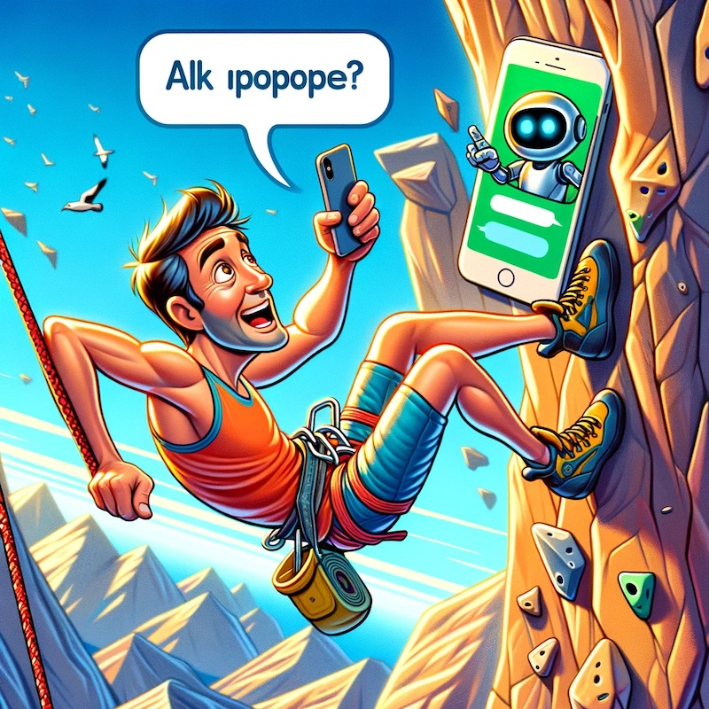

# megabeta-chatbot
Climbing training chatbot based on Jono Megabeta short video scripts

Uses stored data in JSON files to answer questions using OpenAI GPT4

Files not included here:

  - data/
  
  - pycache
  
  - package-lcok.json
  
  - package.json
  
  - public/
  
  - pyproject.toml
  
  - src/
  
  - storage/
  
  - webpack.config.js

**Note** - this code was originally forked from [Dan Shipper's Dynamic Web Based Chatbot V1 (Replit)](https://replit.com/@DanShipper1/A-Dynamic-Web-Based-Agent-Chatbot?v=1)
